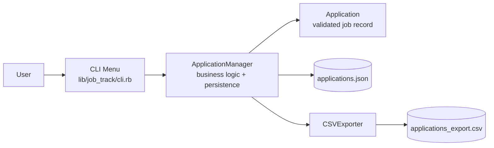
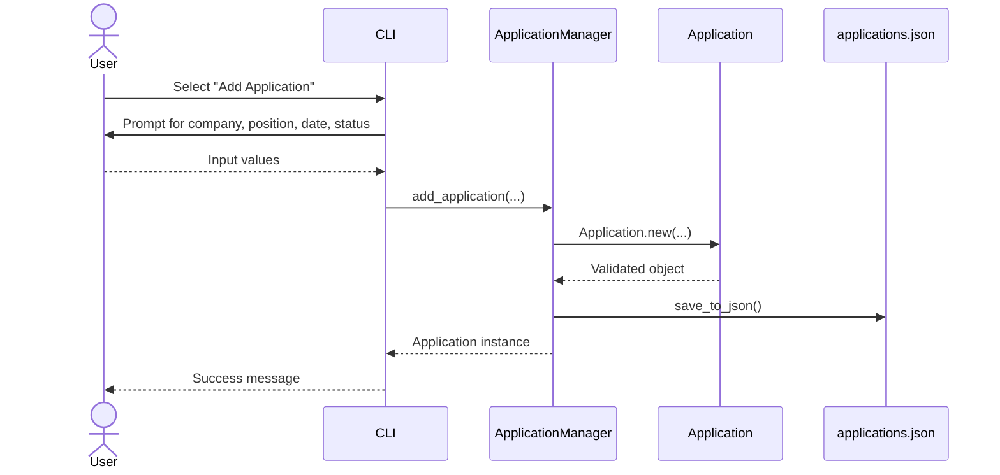
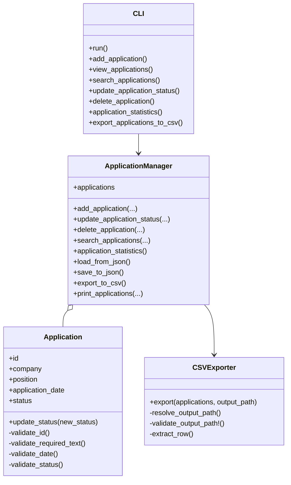

# JobTrack Design

## Overview

JobTrack is a Ruby terminal application that helps students record and manage job
and internship applications. The interface is menu-driven, and application data
is saved locally in JSON so it remains available after the program exits.

# JobTrack System Design Diagrams

## High-level architecture



## Runtime flow: add application



## Class-level design



## Major system design choices and justification

### 1. CLI-first architecture
The application is designed as a command-line interface instead of a graphical or web-based interface because the project is a terminal application and the user interaction model is menu-driven. This keeps the system simple, easy to test, and aligned with the assignment requirements.

### 2. Separation of responsibilities between CLI, manager, and domain model
The system divides responsibilities across three main layers:
- CLI handles user interaction and menu routing.
- ApplicationManager handles application collection logic and persistence.
- Application encapsulates domain validation and business rules.

This separation is justified because it keeps the code easier to understand, reduces coupling, and makes it easier to extend later with new features.

### 3. Validation inside the Application model
Each Application validates its own required fields, date format, and allowed status values before being accepted into the system. This is an important design choice because invalid data should not enter the system at all, which reduces downstream errors and keeps the state consistent.

### 4. JSON as the persistence mechanism
The application stores records in a local JSON file rather than a database. This is justified for a small project with limited scope because it is simple to implement, requires no external services, and works well for a terminal app that stores a manageable amount of data.

### 5. CSV export as a separate specialized component
CSV export is handled by a dedicated CSVExporter class instead of being embedded directly in the manager. This is a good design choice because exporting is a distinct concern from business logic and can be changed independently without affecting the core application behavior.

### 6. In-memory collection with load/save behavior
The manager keeps applications in memory while the system is running and saves them to disk after changes. This design is appropriate for a small CLI application because it is fast, simple, and easy to reason about while still preserving data between runs.

### 7. Restricted status enumeration
The application defines a closed set of accepted statuses: Applied, Interview, Offer, Rejected. This reduces inconsistent data, improves reporting accuracy, and makes filtering and statistics reliable.

## System Design Tradeoffs

- JobTrack does not have a separate data-access layer or database. Add, view,
  search, update, and delete operations work on the manager's in-memory collection,
  and the manager saves the resulting collection to JSON. This keeps the current
  application simple, but it combines collection management and persistence in one
  class, would not scale well for a much larger dataset, and does not support
  multiple users working with shared data.
- Restricting statuses keeps stored data, search results, and statistics
  consistent, but users cannot add custom hiring stages such as Assessment or
  Withdrawn.

## System design summary

- The CLI acts as the presentation layer and user entry point.
- The ApplicationManager is the core service object for business operations and persistence.
- The Application class encapsulates validation and status rules.
- Data is stored in JSON for local persistence and exported to CSV for reporting.
- This is a layered, lightweight architecture suitable for a small terminal application.

### Component responsibilities

- `JobTrack::CLI` displays the menu, collects input, delegates operations to the
  manager, and displays results and validation errors.
- `JobTrack::ApplicationManager` owns the application collection, assigns unique
  sequential IDs, implements application operations, and loads and saves JSON.
- `JobTrack::Application` represents one application and validates its ID, company,
  position, application date, and status.
- `JobTrack::CSVExporter` converts the current collection into a CSV file at a
  default or user-provided path.
- `JobTrack::ValidationError` carries understandable validation messages from the
  model, manager, and CSV exporter to the CLI.
- `bin/job_track` creates the manager and CLI, then starts the program.

## User Interface Design

Each mockup below uses the exact menu labels, prompts, and messages implemented by
the CLI. User input appears after a prompt. After every completed operation or
handled error, JobTrack displays the main menu again.

### Flow 1 - Start JobTrack and load saved data

```text
$ ruby bin/job_track

JobTrack Main Menu
1. Add Application
2. View Applications
3. Search Applications
4. Update Application Status
5. Delete Application
6. Application Statistics
7. Exit
8. Export Applications to CSV
Choose an option:
```

At startup, `ApplicationManager` loads `data/applications.json`. If the file does
not exist, JobTrack starts with an empty application collection and displays the
same menu.

### Flow 2 - Invalid menu selection

```text
JobTrack Main Menu
1. Add Application
2. View Applications
3. Search Applications
4. Update Application Status
5. Delete Application
6. Application Statistics
7. Exit
8. Export Applications to CSV
Choose an option: 9
Invalid menu selection. Please try again.

JobTrack Main Menu
1. Add Application
2. View Applications
3. Search Applications
4. Update Application Status
5. Delete Application
6. Application Statistics
7. Exit
8. Export Applications to CSV
Choose an option:
```

### Flow 3 - Add an application successfully

```text
Choose an option: 1
Add Application selected.
Company: Google
Position: Software Engineer Intern
Application date (YYYY-MM-DD): 2026-09-12
Status (Applied/Interview/Offer/Rejected): Applied
Application #1 added successfully.
Add Application completed.

JobTrack Main Menu
...
```

### Flow 4 - Reject invalid add input

Invalid date:

```text
Choose an option: 1
Add Application selected.
Company: Google
Position: Software Engineer Intern
Application date (YYYY-MM-DD): 2026-02-30
Status (Applied/Interview/Offer/Rejected): Applied
Error: Application date must be a valid date in YYYY-MM-DD format

JobTrack Main Menu
...
```

Invalid status:

```text
Choose an option: 1
Add Application selected.
Company: Google
Position: Software Engineer Intern
Application date (YYYY-MM-DD): 2026-09-12
Status (Applied/Interview/Offer/Rejected): Pending
Error: Status must be one of: Applied, Interview, Offer, Rejected

JobTrack Main Menu
...
```

Missing required field:

```text
Choose an option: 1
Add Application selected.
Company:
Position: Software Engineer Intern
Application date (YYYY-MM-DD): 2026-09-12
Status (Applied/Interview/Offer/Rejected): Applied
Error: Company cannot be empty

JobTrack Main Menu
...
```

The failed application is not added. A failed operation displays an error instead
of an `Add Application completed.` message.

### Flow 5 - View all applications

With saved applications:

```text
Choose an option: 2
View Applications selected.
ID | Company | Position | Application Date | Status
1 | Google | Software Engineer Intern | 2026-09-12 | Applied
2 | Netflix | Backend Intern | 2026-09-13 | Interview
View Applications completed.

JobTrack Main Menu
...
```

With no saved applications:

```text
Choose an option: 2
View Applications selected.
No applications found.
View Applications completed.

JobTrack Main Menu
...
```

### Flow 6 - Search applications

Matching results:

```text
Choose an option: 3
Search Applications selected.
Search field (company/position/status): company
Search value: goo
ID | Company | Position | Application Date | Status
1 | Google | Software Engineer Intern | 2026-09-12 | Applied
Search Applications completed.

JobTrack Main Menu
...
```

Search is case-insensitive and accepts partial values. The available fields are
`company`, `position`, and `status`.

No matching results:

```text
Choose an option: 3
Search Applications selected.
Search field (company/position/status): company
Search value: Apple
No matching applications found.
Search Applications completed.

JobTrack Main Menu
...
```

Invalid field or empty value:

```text
Choose an option: 3
Search Applications selected.
Search field (company/position/status): date
Search value: 2026-09-12
Error: Invalid search field.

JobTrack Main Menu
...
```

```text
Choose an option: 3
Search Applications selected.
Search field (company/position/status): company
Search value:
Error: Search value cannot be empty.

JobTrack Main Menu
...
```

### Flow 7 - Update an application status

Successful update:

```text
Choose an option: 4
Update Application Status selected.
Application ID: 1
New status (Applied/Interview/Offer/Rejected): Interview
Application #1 status updated to Interview.
Update Application Status completed.

JobTrack Main Menu
...
```

Invalid status leaves the original application unchanged:

```text
Choose an option: 4
Update Application Status selected.
Application ID: 1
New status (Applied/Interview/Offer/Rejected): Waiting
Error: Status must be one of: Applied, Interview, Offer, Rejected

JobTrack Main Menu
...
```

Unknown or invalid ID:

```text
Choose an option: 4
Update Application Status selected.
Application ID: 99
New status (Applied/Interview/Offer/Rejected): Offer
Error: Application with ID 99 was not found

JobTrack Main Menu
...
```

### Flow 8 - Delete an application

Successful deletion:

```text
Choose an option: 5
Delete Application selected.
Application ID: 2
Application #2 deleted successfully.
Delete Application completed.

JobTrack Main Menu
...
```

Unknown ID, including deletion from an empty collection:

```text
Choose an option: 5
Delete Application selected.
Application ID: 99
Error: Application with ID 99 was not found

JobTrack Main Menu
...
```

### Flow 9 - View application statistics

With saved applications:

```text
Choose an option: 6
Application Statistics selected.
Total Applications: 5
Applied: 2
Interview: 1
Offer: 1
Rejected: 1
Application Statistics completed.

JobTrack Main Menu
...
```

With no saved applications:

```text
Choose an option: 6
Application Statistics selected.
Total Applications: 0
Applied: 0
Interview: 0
Offer: 0
Rejected: 0
Application Statistics completed.

JobTrack Main Menu
...
```

### Flow 10 - Export applications to CSV

Using the default Downloads location:

```text
Choose an option: 8
Export Applications to CSV selected.
Export path (press Enter for default Downloads folder):
CSV export saved to: /Users/student/Downloads/applications_export.csv
Export Applications to CSV completed.

JobTrack Main Menu
...
```

Using an invalid directory:

```text
Choose an option: 8
Export Applications to CSV selected.
Export path (press Enter for default Downloads folder): /missing/applications.csv
Error: Export directory does not exist: /missing

JobTrack Main Menu
...
```

The export contains the header fields `id`, `company`, `position`,
`application_date`, and `status`. An empty collection produces a valid CSV with
only the header row.

### Flow 11 - Exit and restart

```text
Choose an option: 7
Goodbye!
```

Successful add, update, and delete operations save all application fields to
`data/applications.json` immediately. Selecting Exit ends the menu loop. On the
next run, saved applications are loaded and IDs continue after the highest saved ID.

```text
$ ruby bin/job_track

JobTrack Main Menu
...
Choose an option: 2
View Applications selected.
ID | Company | Position | Application Date | Status
1 | Google | Software Engineer Intern | 2026-09-12 | Interview
View Applications completed.
```

## Major UI Design Choices and Tradeoffs

### Simple terminal interface

JobTrack uses a text-based interface that is lightweight, easy to run, and
appropriate for the project requirements.

### Numbered menu options

All available operations are displayed in a numbered menu. The user only needs to
select a number to begin an operation.

### Step-by-step prompts

After an operation is selected, JobTrack asks only for the information required
for that operation, such as an application ID or a new status.

### Clear operation feedback and understandable error messages

JobTrack confirms the selected operation and displays a success message when the
operation completes successfully. Invalid menu selections, dates, statuses, IDs,
search values, and export paths produce clear error messages instead of terminating
the program.

### Safe recovery from errors

After displaying an error, JobTrack returns to the main menu so the user can
correct the input or select another operation.

### Clear empty-state messages

When no applications or search results exist, JobTrack explicitly tells the user
instead of displaying an empty screen.

### UI tradeoffs

- The numbered menu is simple, but it may become crowded and harder to navigate if
  many more features are added.
- When an error occurs, the user must select the operation again and re-enter all
  inputs, including values that were already valid.
- Applications are displayed in fixed text columns. Long company names or position
  titles may reduce readability or cause uneven alignment in the terminal.
- View and Search do not paginate their results. A large collection or a broad
  search may produce crowded terminal output that is difficult to review.
- The current search workflow asks for one field and one value. Supporting
  multi-field searches with optional filters would require additional prompts and
  rules for combining the selected filters.
- JobTrack has no login interface. Every run uses the same local collection, so the
  UI cannot identify different users or provide separate user accounts.
