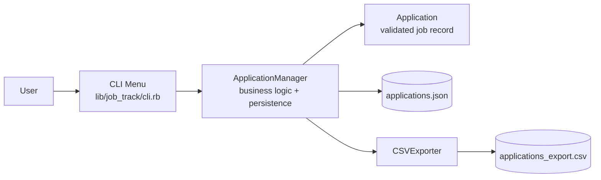
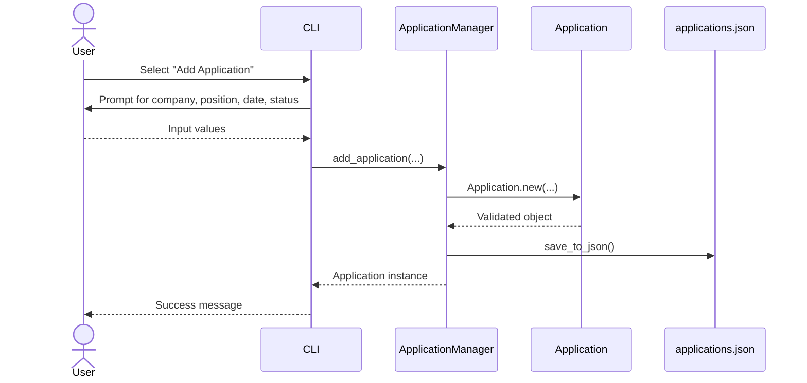
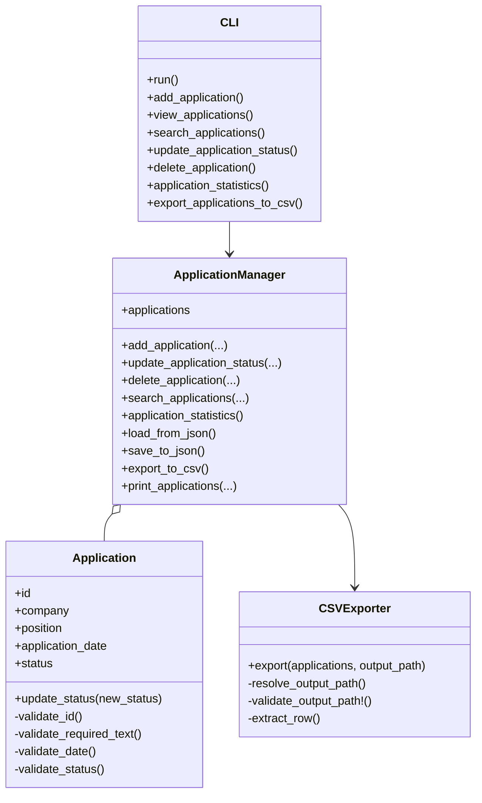

# JobTrack System Design Diagrams

## High-level architecture

## Runtime flow: add application

## Class-level design

## Major system design choices and justification

### 1. CLI-first architecture
The application is designed as a command-line interface instead of a graphical or web-based interface because the project is a terminal application and the user interaction model is menu-driven. This keeps the system simple, easy to test, and aligned with the assignment requirements.

### 2. Separation of responsibilities between CLI, manager, and domain model
The system divides responsibilities across three main layers:
- CLI handles user interaction and menu routing.
- ApplicationManager handles application collection logic and persistence.
- Application encapsulates domain validation and business rules.

This separation is justified because it keeps the code easier to understand, reduces coupling, and makes it easier to extend later with new features.

### 3. Validation inside the Application model
Each Application validates its own required fields, date format, and allowed status values before being accepted into the system. This is an important design choice because invalid data should not enter the system at all, which reduces downstream errors and keeps the state consistent.

### 4. JSON as the persistence mechanism
The application stores records in a local JSON file rather than a database. This is justified for a small project with limited scope because it is simple to implement, requires no external services, and works well for a terminal app that stores a manageable amount of data.

### 5. CSV export as a separate specialized component
CSV export is handled by a dedicated CSVExporter class instead of being embedded directly in the manager. This is a good design choice because exporting is a distinct concern from business logic and can be changed independently without affecting the core application behavior.

### 6. In-memory collection with load/save behavior
The manager keeps applications in memory while the system is running and saves them to disk after changes. This design is appropriate for a small CLI application because it is fast, simple, and easy to reason about while still preserving data between runs.

### 7. Restricted status enumeration
The application defines a closed set of accepted statuses: Applied, Interview, Offer, Rejected. This reduces inconsistent data, improves reporting accuracy, and makes filtering and statistics reliable.

## System design summary

- The CLI acts as the presentation layer and user entry point.
- The ApplicationManager is the core service object for business operations and persistence.
- The Application class encapsulates validation and status rules.
- Data is stored in JSON for local persistence and exported to CSV for reporting.
- This is a layered, lightweight architecture suitable for a small terminal application.
