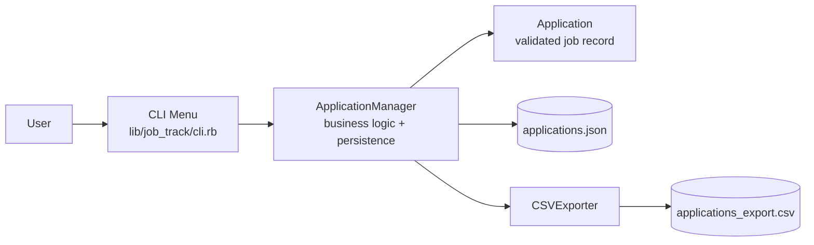
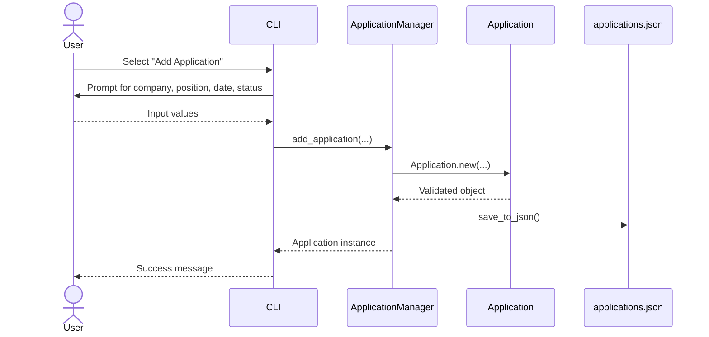
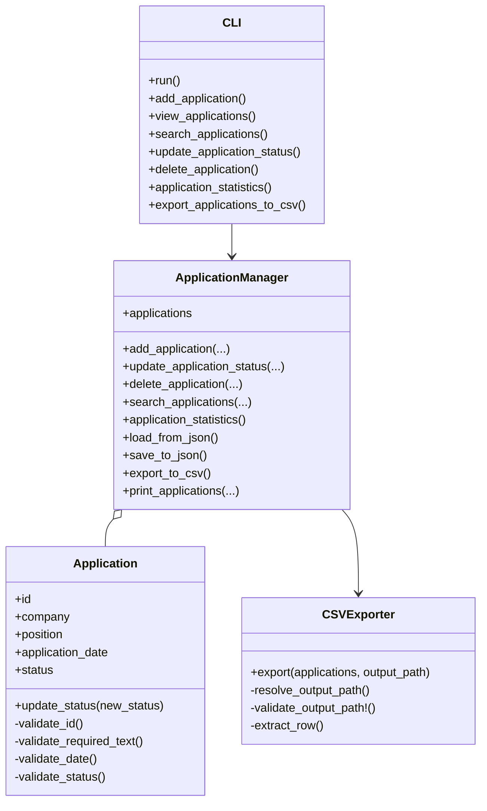

# JobTrack System Design Diagrams

## High-level architecture

## Runtime flow: add application

## Class-level design

## System design summary

- The CLI acts as the presentation layer and user entry point.
- The ApplicationManager is the core service object for business operations and persistence.
- The Application class encapsulates validation and status rules.
- Data is stored in JSON for local persistence and exported to CSV for reporting.
- This is a layered, lightweight architecture suitable for a small terminal application.
